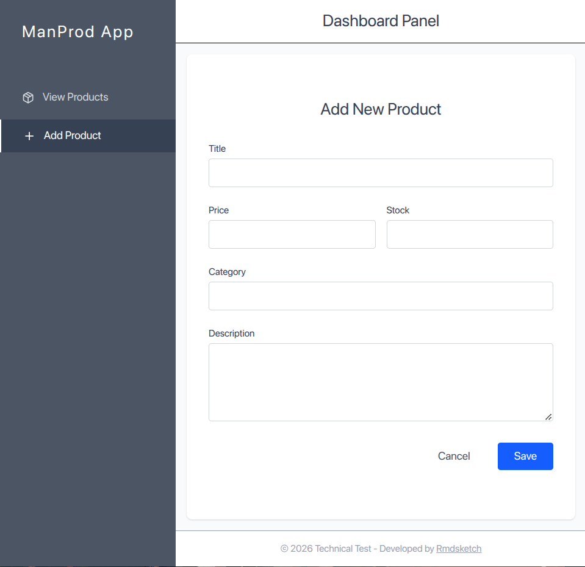
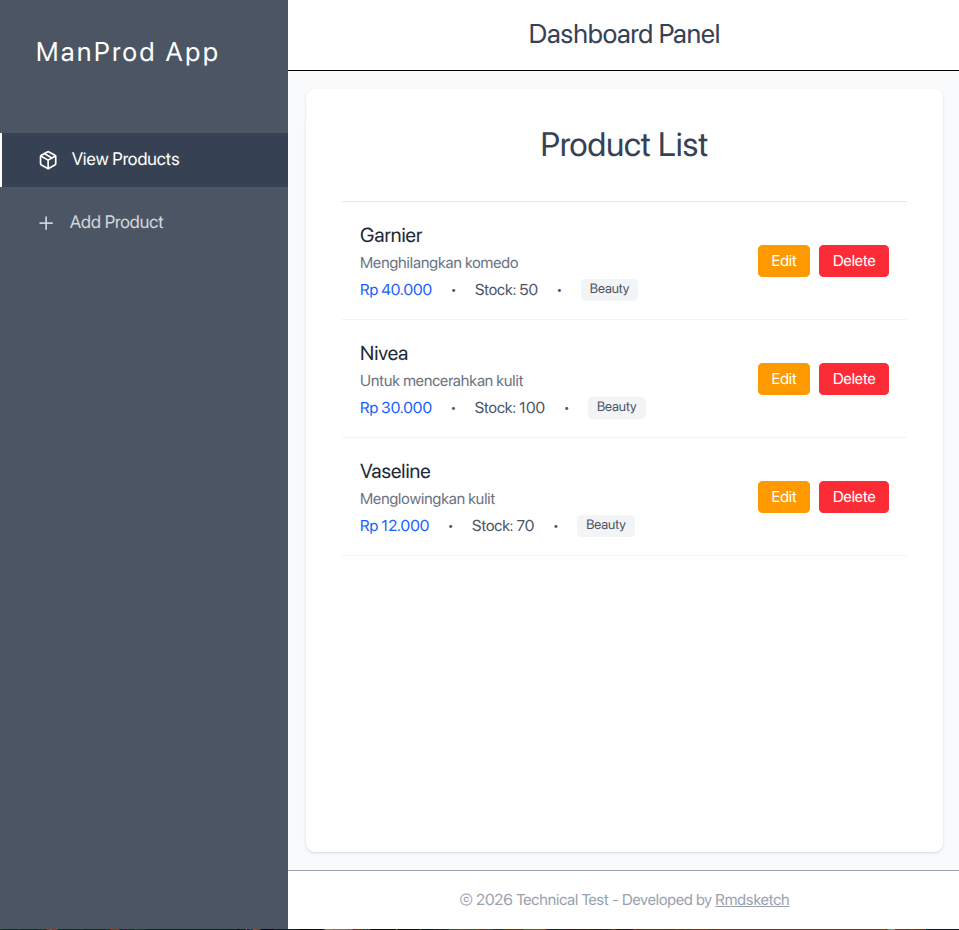

# Product Management System

This repository contains a full-stack CRUD application for managing products. 
It follows a Clean Architecture approach with a decoupled Frontend and Backend.

**GitHub Repository URL:** `https://github.com/Rmdsketch`

## 🚀 Setup Instructions

### Environment Prerequisites
- Node.js (v18+)
- Python 3.12+
- MySQL Server

### 1. Backend Setup (Flask & MySQL)
The backend is built with Python, Flask, Flask-RESTful, and SQLAlchemy.

1. **Database Setup**:
   Ensure you have a local MySQL server running. Create a database named `marketplace_db`.
   *(You can modify the database connection string in `backend/config.py` if your MySQL username/password differs from the default `root`/`your_password`).*

2. **Activate Virtual Environment**:
   ```bash
   cd backend
   source ../.venv/bin/activate
   ```

3. **Install Dependencies**:
   ```bash
   pip install -r requirements.txt
   ```

4. **Run the Backend**:
   ```bash
   python app.py
   ```
   *The Flask API will run on `http://localhost:5000`.*

### 2. Frontend Setup (React, TypeScript & Vite)
The frontend is built with React 19, TypeScript, TailwindCSS, and Vite.

1. **Navigate to the frontend folder**:
   ```bash
   cd frontend
   ```

2. **Install Dependencies**:
   ```bash
   npm install
   ```

3. **Run the Frontend**:
   ```bash
   npm run dev
   ```
   *The React app will be accessible at `http://localhost:5173`.*

## ⚙️ Environment Variables
Currently, the application relies on hardcoded configurations for simplicity.
- **Backend**: The MySQL connection string is located directly in `backend/config.py`. For a production environment, this should be moved to a `.env` file using `python-dotenv`.
- **Frontend**: The API base URL is set to `http://localhost:5000/` inside `frontend/src/services/api.ts`. In production, this should be an environment variable (e.g., `VITE_API_BASE_URL`).

## 🔄 API Flow
The system follows a RESTful architecture. Communication between frontend and backend uses Axios.

| Method | Endpoint | Description |
| :--- | :--- | :--- |
| `GET` | `/products` | Retrieves a list of all products. |
| `POST` | `/products` | Creates a new product. Expects JSON payload (name, price, stock, description, category). |
| `GET` | `/products/<id>` | Retrieves details of a specific product by its id. |
| `PUT` | `/products/<id>` | Updates an existing product. |
| `DELETE`| `/products/<id>` | Deletes a product from the database. |

**Data Flow:**
1. User interacts with the UI in the React Frontend (fills out `ProductForm`).
2. Frontend calls the appropriate Axios method in `api.ts`.
3. Request reaches the Flask backend. `ProductSchema` validates the incoming JSON (ignoring system read-only fields like `created_at` thanks to the `unknown=EXCLUDE` configuration).
4. SQLAlchemy commits the transaction to the MySQL Database.
5. JSON response is sent back to the frontend, updating the UI state dynamically.

## 📸 Screenshots / Demo
- 
- 

## 📝 Notes & Tradeoffs

- **Precision with Currency**: The `price` field in the database was converted from `Float` to `Integer`. This is a best practice to avoid **IEEE 754 Floating-Point** calculation errors. On the frontend, `react-number-format` is used to format it dynamically as users type.
- **Form Component Optimization**: The `ProductForm` utilizes a technique of keeping internal states as `String` during typing to allow smooth decimal inputs. They are then strictly cast to `Number` right before API submission.
- **Unfinished Parts & Limitations**:
  - **Pagination**: There is currently no pagination for the Product List view. If the dataset grows significantly, `GET /products` performance will degrade.
  - **Stock Management**: The stock update logic remains stagnant and has not yet been integrated into a dynamic transaction flow.
  - **Soft Deletes & State**: Although an `is_active` field exists in the database schema, its implementation has not been further explored. Currently, the `DELETE` method performs a *Hard Delete* (permanently removing data) from the database.